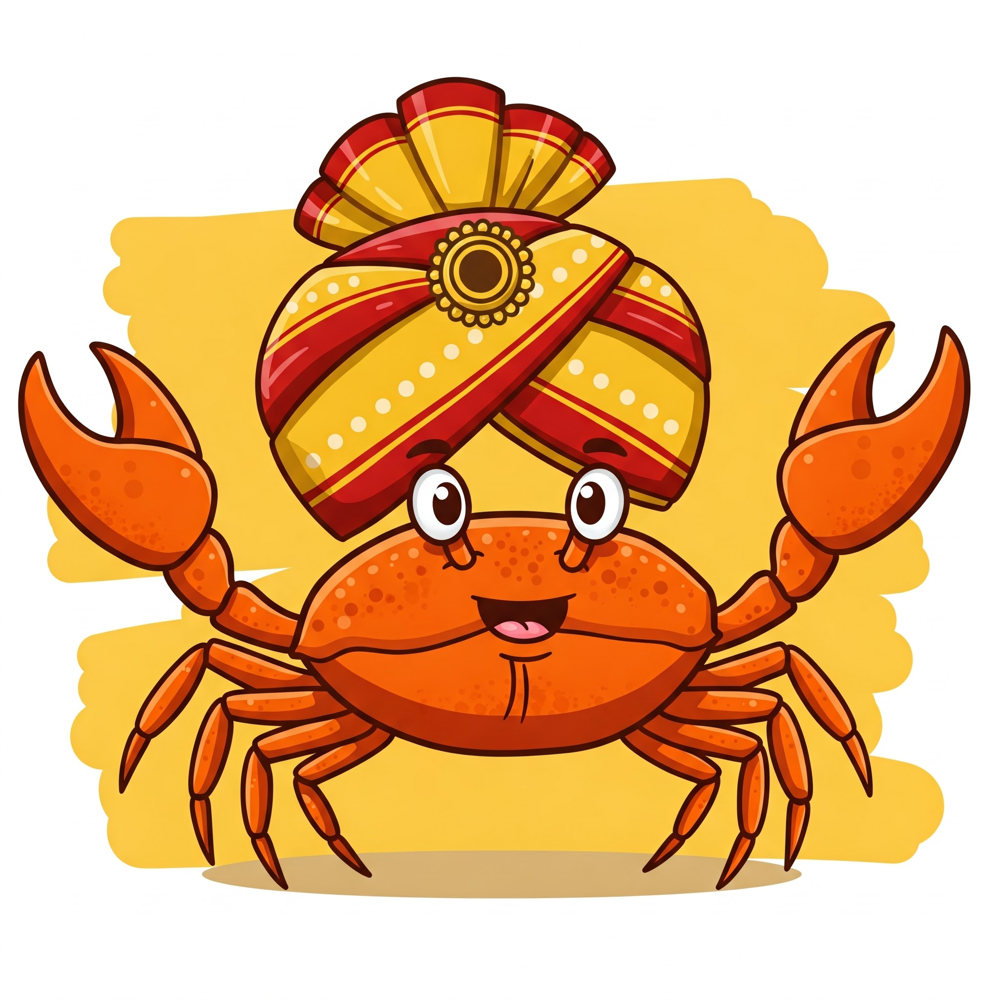

# Tukku (ತುಕ್ಕು) 



Aren't you tired (ಸುಸ್ತಾಗಿದ್ದೀರಾ?) of writing Rust programs in just English? Feel like you've had enough of the usual syntax and want something with a little more... local south-indian flavor (ನಮ್ಮೂರ ಸೊಗಡು)? Want to try something different, perhaps in a language that's both exotic and feels like home (ನಮ್ಮ ಭಾಷೆಯಲ್ಲಿ!)?

Then **Tukku** (ತುಕ್ಕು), which is the Kannada word for Rust (ತುಕ್ಕು), is here to save your day! It lets you write Rust programs using ಕನ್ನಡ – that means using ಕನ್ನಡ keywords, and perhaps adopting some Kannada-style function names or idioms (ಕನ್ನಡದ ವಿಶಿಷ್ಟ ಶೈಲಿ!).

Don't worry! ತುಕ್ಕು, the Kannada Rust, is fully compatible with standard English-Rust. So you can easily mix and match (ಬೆರೆಸಿ ಬಳಸಬಹುದು) both in your projects, using the power of Rust with the beauty of Kannada.

## Getting Started

The project is now using the Kannada branch (ಮುಖ್ಯ) as the main branch. To get started:

```bash
git clone https://github.com/sanathNU/tukku.git
cd tukku
git checkout ಮುಖ್ಯ  # Switch to the Kannada branch
```

### Available Kannada Keywords

Here are some of the Kannada keywords you can use in your Rust code:

- `ಸಾರ್ವಜನಿಕ` → `pub` (public)
- `ಕಾರ್ಯ` → `fn` (function)
- `ಮಾಡು` → `let` (let)
- `ಯದಿ` → `if` (if)
- `ಅಥವಾ` → `else` (else)
- `ರಚನೆ` → `struct` (struct)
- `ವರ್ಗ` → `enum` (enum)
- `ಬದಲು` → `mut` (mutable)
- `ಮುದ್ರಿಸು` → `println!` (print)
- `ಯಾವಾಗ` → `while` (while)
- `ಮುಖ್ಯ` → `main` (main)

### Example Usage

```rust
kannada! {
    ಸಾರ್ವಜನಿಕ ಕಾರ್ಯ ಮುಖ್ಯ() {
        ಮಾಡು ಬದಲು x = 5;
        ಯಾವಾಗ x > 0 {
            ಮುದ್ರಿಸು!("ಧನಾತ್ಮಕ");
            x = x - 1;
        }
    }
}
```

### Other examples

See the [examples](./examples/src/main.rs) to get a rough sense of the whole
syntax. ಅಷ್ಟೇ, that's it.

## Contributions (ಕೊಡುಗೆಗಳು)

First of all ಧನ್ಯವಾದಗಳು, for considering participating in this... ಸಂತೋಷಕರ project! 

Feel free to throw in a few Kannada ಗುರುತುಗಳು or sprinkle some Kannada ಸೊಗಡು here and there in the code. Once you have something, open a pull-request against the ಮುಖ್ಯ branch (that's the main branch).

Please don't introduce swear words, though. ನಮ್ಮ 'ತುಕ್ಕು' ಕೋಡಿನಲ್ಲಿ ಅಂತಹ ಶಬ್ದಗಳು ಒಂಥರಾ ವಿಚಿತ್ರವಾಗಿ ಕೇಳಿಸುತ್ತವೆ! (Such words sound somewhat weird in our 'Tukku' code!)

## but ಯಾಕೆ?

- ಸುಮ್ನೆ timepass
- playing with raw proc macros


## Other languages

Here are some other language flavors of Rust you can enjoy!
- Dutch: [roest](https://github.com/jeroenhd/roest)
- German: [rost](https://github.com/michidk/rost)
- Polish: [rdza](https://github.com/phaux/rdza)
- Italian: [ruggine](https://github.com/DamianX/ruggine)
- Russian: [Ржавый](https://github.com/Sanceilaks/rzhavchina)
- Esperanto: [rustteksto](https://github.com/dscottboggs/rustteksto)
- Toki Pona: [jaki kiwen](https://github.com/jgcodes2020/jaki-kiwen)
- Hindi: [zung](https://github.com/rishit-khandelwal/zung)
- Hungarian: [rozsda](https://github.com/jozsefsallai/rozsda)
- Chinese: [xiu (锈)](https://github.com/lucifer1004/xiu)
- Spanish: [rustico](https://github.com/UltiRequiem/rustico)
- Korean: [Nok (녹)](https://github.com/Alfex4936/nok)
- Finnish: [ruoste](https://github.com/vkoskiv/ruoste)
- Arabic: [sada](https://github.com/LAYGATOR/sada)
- Turkish: [pas](https://github.com/ekimb/pas)
- Vietnamese: [gỉ](https://github.com/Huy-Ngo/gir)
- Japanese: [sabi (錆)](https://github.com/yuk1ty/sabi)
- Danish: [rust?](https://github.com/LunaTheFoxgirl/rust-dk)
- Marathi: [gan̄ja](https://github.com/pranavgade20/ganja)
- Romanian: [rugină](https://github.com/aionescu/rugina)
- Czech: [rez](https://github.com/radekvit/rez)
- Ukrainian: [irzha](https://github.com/brokeyourbike/irzha)
- Bulgarian: [ryzhda](https://github.com/gavadinov/ryzhda)
- Slovak: [hrdza](https://github.com/TheMessik/hrdza)
- Catalan: [rovell](https://github.com/gborobio73/rovell)
- Corsican: [rughjina](https://github.com/aldebaranzbradaradjan/rughjina)
- Indonesian: [karat](https://github.com/annurdien/karat)
- Lithuanian: [rūdys](https://github.com/TruncatedDinosour/rudys)
- Greek: [skouriasmeno](https://github.com/devlocalhost/skouriasmeno)
- Thai: [sanim (สนิม)](https://github.com/korewaChino/sanim)
- Swiss: [roeschti](https://github.com/Georg-code/roeschti)
- Swedish: [rost](https://github.com/vojd/rost/)
- Croatian: [hrđa](https://github.com/njelich/hrdja)
- Persian: [zangar (زنگار)](https://github.com/ui-ce/zangar)
- Malagasy: [arafesina](https://github.com/luckasRanarison/arafesina)
- Latin: [ferrugo](https://github.com/pianoman911/ferrugo)
- Norwegian: [korrosjon](https://github.com/datagutt/korrosjon)
- Estonian: [rooste](https://github.com/hanshs/rooste)
- All of the above: [unirust](https://github.com/charyan/unirust)


## License (ಅನುಮತಿ)
[WTFPL](http://www.wtfpl.net/)
